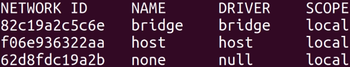

[Docker](https://docs.docker.com/engine/install/ubuntu/#install-using-the-repository) Installation on Linux

# EN

## Install Docker

### Add Docker's official GPG key

```bash
sudo apt-get update
sudo apt-get install ca-certificates curl
sudo install -m 0755 -d /etc/apt/keyrings
sudo curl -fsSL https://download.docker.com/linux/ubuntu/gpg -o /etc/apt/keyrings/docker.asc
sudo chmod a+r /etc/apt/keyrings/docker.asc
```

### Add the repository to Apt sources

```bash
echo \
"deb [arch=$(dpkg --print-architecture) signed-by=/etc/apt/keyrings/docker.asc] https://download.docker.com/linux/ubuntu \
$(. /etc/os-release && echo "$VERSION_CODENAME") stable" | \
sudo tee /etc/apt/sources.list.d/docker.list > /dev/null
sudo apt-get update
```

### Install Latest version of Docker

```bash
sudo apt-get install docker-ce docker-ce-cli containerd.io docker-buildx-plugin docker-compose-plugin
```

## Run a Docker container

To run a Docker container, you can use the following command, replacing `<image_name>` with the name of the image you want to run:

```bash
sudo docker run -d --name <container_name> <image_name>
```

This command will pull the Docker image if not already present locally, start a container in detached mode, and assign it the given name.

## Create your own Docker Image and Push it to Docker Hub
WIP

# DE

## What about Docker

Docker is a platform for developing, shipping, and running applications in containers. Containers allow a developer to package up an application with all parts it needs, such as libraries and other dependencies, and ship it all out as one package. By doing so, the developer can be sure that the application will run on any other Linux machine regardless of any customized settings that machine might have that could differ from the machine used for writing and testing the code.

### Virtualisierung vs Containerisierung

Container:

- Leichtgewichtig 
- Teilt den OS-Kernel mit dem Host 
- Enthält nur die notwendigen Anwendungen und Bibliotheken 
- Startet schnell und verbraucht wenig Ressourcen 

Virtuelle Maschinen:
- Schwergewichtig 
- Enthält das gesamte Betriebssystem (erfordert Hypervisor)
- Isolation durch Hypervisor 
- Langsamer und ressourcenintensiver Start

### Docker

Docker ist eine Open-Source-Plattform, die es ermöglicht, Anwendungen in Containern zu verpacken, bereitzustellen und auszuführen. Dadurch werden Anwendungen und deren Abhängigkeiten unabhängig vom Host-Betriebssystem, was das Deployment vereinfacht. Docker-Container sind portable Laufzeitumgebungen, die isolierte und reproduzierbare Umgebungen durch Docker-Images bereitstellen, die alle nötigen Abhängigkeiten enthalten.

Docker-Architektur:
- Docker-Engine: Kernkomponente, die Container erstellt und verwaltet. 
- Docker-Daemon: Hintergrundprozess, der Docker-Objekte (Container, Images, Volumes) steuert. 
- Docker-CLI: Kommandozeilenwerkzeug zur Interaktion mit der Docker-Engine.

Vorteile von Docker:
- Portabilität: Einmal erstellte Container laufen überall (Cloud, Server, lokal). 
- Konsistenz: Gleiche Umgebungen in Entwicklung und Produktion. 
- Schnelles Deployment: Container starten schneller als VMs. 
- Ressourceneffizienz: Container benötigen weniger Speicher und Rechenleistung.

#### Beispiel für Docker-Befehle:
Hier wird gezeigt wie einfach es ist einen Container zu starten.

```bash
docker run -d -p 8888:80 --name apache2 ubuntu/apache2:latest
```

Mit diesem Befehl ist es möglich einen Apache2 Webserver in einem Container zu starten. Der Container wird im Hintergrund gestartet und der Port 8888 des Hosts wird auf den Port 80 des Containers gemappt.

Aufbau des Docker-Befehls:
- `docker run`: Startet einen neuen Container.
- `-d`: Startet den Container im Hintergrund.
- `-p 8888:80`: Mapt den Port 8888 des Hosts auf den Port 80 des Containers.
- `--name apache2`: Gibt dem Container den Namen "apache2".
- `ubuntu/apache2:latest`: Verwendet das Image "ubuntu/apache2" mit dem Tag "latest".
- `latest`: Tag des Images, in diesem Fall die neueste Version.

#### Dockerbefehle
- `docker run`: Startet einen neuen Container.
- `docker ps`: Zeigt alle laufenden Container an.
- `docker ps -a`: Zeigt alle Container an.
- `docker stop <container_id>`: Stoppt einen Container.
- `docker start <container_id>`: Startet einen gestoppten Container.
- `docker rm <container_id>`: Löscht einen Container.
- `docker rmi <image_id>`: Löscht ein Image.
- `docker images`: Zeigt alle Images an.
- `docker pull <image_name>`: Lädt ein Image herunter.
- `docker push <image_name>`: Lädt ein Image auf Docker Hub hoch.
- `docker exec -it <container_id> bash`: Startet eine interaktive Shell in einem Container.
- `docker logs <container_id>`: Zeigt die Logs eines Containers an.
- `docker inspect <container_id>`: Zeigt detaillierte Informationen über einen Container an.
- `docker stats`: Zeigt die Ressourcennutzung der laufenden Container an.

#### Docker-Volumes
Persistente Speicherlösung für Docker-Container, die Daten auch nach dem Neustarten des Containers bewahrt.

#### Docker-Networks

Es gibt 7 verschiedene Netzwerkarten in Docker:

Default Bridge Network: Standard-Netzwerk, das von Docker bereitgestellt wird.
- Ein virtuelles Netzwerk.

Docker Netzwerke anzeigen lassen:

```bash
docker network ls
```


- `NETWORK ID`: Eindeutige ID des Netzwerks.
- `NAME`: Name des Netzwerks.
- `DRIVER`: Treiber des Netzwerks.
- `SCOPE`: Sichtbarkeit des Netzwerks.

##### Bridge Netzwerk

Standard Netzwerke: `Bridge`

Das Bridge-Netzwerk ist das Standardnetzwerk, das Docker verwendet, wenn kein anderes Netzwerk explizit angegeben wird. Es ist eine virtuelle Netzwerkschnittstelle, die es Containern ermöglicht, miteinander zu kommunizieren, während sie von der Außenwelt isoliert bleiben.

Eigenschaften:
- Container erhalten eine eigene IP-Adresse innerhalb des Bridge-Netzwerks (standardmäßig 172.x.x.x).
- Container können über diese IP-Adressen oder Container-Namen miteinander kommunizieren.
- Die Außenwelt kann auf Container nur zugreifen, wenn Ports explizit freigegeben werden (-p oder --publish).
- Es nutzt NAT (Network Address Translation), um den Verkehr zwischen dem Docker-Host und Containern zu ermöglichen.

Vorteile:
- Einfache Konfiguration und Verwendung.
- Gute Isolation der Container.
- Einfacher Zugriff auf Container durch Port-Mapping.


Mit dem Befehl
```bash
docker network inspect bridge
```
kann man sich die Informationen des Bridge Netzwerks anzeigen lassen.

```json
[
  {
    "Name": "bridge",
    "Id": "3d7014a8b159afd9018310fa42a78f7e84fdb6dabab7c5a072146d94eb814f0c",
    "Created": "2024-11-05T07:22:58.436486668Z",
    "Scope": "local",
    "Driver": "bridge",
    "EnableIPv6": false,
    "IPAM": {
      "Driver": "default",
      "Options": null,
      "Config": [
        {
          "Subnet": "172.17.0.0/16",
          "Gateway": "172.17.0.1"
        }
      ]
    },
    "Internal": false,
    "Attachable": false,
    "Ingress": false,
    "ConfigFrom": {
      "Network": ""
    },
    "ConfigOnly": false,
    "Containers": {
      "3f55ac9eac446f2d88b54ba6c31fc81a869e6002303020dd477552f8dad7ba78": {
        "Name": "OllamaUI",
        "EndpointID": "09b08412df42d0e358130315ce86e322f99427a3effe7d8f3ed6060be26a83f4",
        "MacAddress": "02:42:ac:11:00:05",
        "IPv4Address": "172.17.0.5/16",
        "IPv6Address": ""
      },
      "95a180a5fe90890294cf71690fe9bcc0534d60d22f71bd5a085b769f13fbc6e5": {
        "Name": "my-mysql",
        "EndpointID": "31b3324e7f8d07d166f7cd7f7e950ac3ee7f63da87fc326d3513ac15cb1ed420",
        "MacAddress": "02:42:ac:11:00:03",
        "IPv4Address": "172.17.0.3/16",
        "IPv6Address": ""
      },
      "bc27198fa2b63fe07bff11c18be6814e05ba0e54c0bc38f48c7ea150dcf756d7": {
        "Name": "buildx_buildkit_wizardly_lamport0",
        "EndpointID": "30b2b3362b0cbe37b7b387aa38f8001971fb7ddfec92325d850e8854010668b4",
        "MacAddress": "02:42:ac:11:00:02",
        "IPv4Address": "172.17.0.2/16",
        "IPv6Address": ""
      },
      "c5780243f11251bc99800c91e44e2013ea9813a8dbe20f3edea9cec3cf7592e9": {
        "Name": "uptime-kuma",
        "EndpointID": "7d006cacd02343fbcbdb8fb261fef188d264bd958683ec4a8003ad1adcb8f5d3",
        "MacAddress": "02:42:ac:11:00:04",
        "IPv4Address": "172.17.0.4/16",
        "IPv6Address": ""
      }
    },
    "Options": {
      "com.docker.network.bridge.default_bridge": "true",
      "com.docker.network.bridge.enable_icc": "true",
      "com.docker.network.bridge.enable_ip_masquerade": "true",
      "com.docker.network.bridge.host_binding_ipv4": "0.0.0.0",
      "com.docker.network.bridge.name": "docker0",
      "com.docker.network.driver.mtu": "65535"
    },
    "Labels": {}
  }
]
```

##### Host Netzwerk

Es nutzt NAT (Network Address Translation), um den Verkehr zwischen dem Docker-Host und Containern zu ermöglichen.

Eigenschaften:
- Container verwendet die Netzwerk-Schnittstellen des Hosts (z. B. eth0 des Hosts).
- Kein Port-Mapping erforderlich, da der Container die gleichen Ports wie der Host verwendet.
- Schneller als Bridge, da keine virtuelle Netzwerkschicht dazwischen liegt.
- Keine Isolation auf Netzwerkebene.

Vorteile:
- Weniger Overhead und daher schneller.
- Sinnvoll für Anwendungen, die direkten Zugriff auf das Netzwerk des Hosts benötigen (z. B. Monitoring-Anwendungen).

Nachteile:
- Keine Isolation auf Netzwerkebene.
- Konfilkte möglich, wenn ein Container und der Host denselben Port verwenden.

##### None Netzwerk

Das None-Netzwerk deaktiviert die Netzwerkkonnektivität des Containers vollständig. Der Container hat keinen Zugriff auf andere Container, den Host oder das Internet.

Eigenschaften:
- Container ist vollständig isoliert auf Netzwerkebene.
- Keine Netzwerkschnittstelle im Container außer der lo (Loopback-Schnittstelle).
- Ideal für Anwendungen, die kein Netzwerk benötigen.

Vorteile:
- Maximale Sicherheit und Isolation.
- Verhindert versehentliche Netzwerkkonflikte.

Nachteile:
- Kein Zugriff auf andere Dienste oder das Internet.

##### Vergleiche der Standard Netzwerke

| Feature           | Bridge            | Host                 | None               |
|--------------------|-------------------|----------------------|--------------------|
| **Isolation**      | Gut               | Keine                | Vollständig        |
| **Performance**    | Moderate          | Hoch                 | Hoch               |
| **Internet-Zugang**| Optional (Port-Mapping) | Direkt               | Kein Zugang        |
| **Anwendung**      | Standard-Container | Netzwerkanwendungen   | Isolierte Prozesse |

---

**Fazit:**
- Verwende **bridge**, wenn du Container isolieren, aber dennoch miteinander kommunizieren lassen möchtest.
- Verwende **host**, wenn die Performance wichtig ist oder der Container direkten Zugriff auf das Host-Netzwerk benötigt.
- Verwende **none**, wenn der Container kein Netzwerk benötigt oder maximale Isolation erforderlich ist.

#### Nicht-Standard Netzwerke

Neben den Standardnetzwerken (**bridge**, **host**, **none**) bietet Docker auch **benutzerdefinierte Netzwerke**, die mehr Kontrolle und Flexibilität bei der Konfiguration ermöglichen. Diese Netzwerke erlauben es, Container gezielt zu verbinden und komplexere Netzwerktopologien zu erstellen. Es gibt hauptsächlich zwei nicht-standardmäßige Netzwerke: **Overlay** und **Macvlan**, sowie benutzerdefinierte **Bridge-Netzwerke**.

##### Benutzerdefiniertes Bridge-Netzwerk
Ein benutzerdefiniertes Bridge-Netzwerk ist eine Erweiterung des Standard-Bridge-Netzwerks mit zusätzlichen Funktionen, wie z. B. benutzerdefinierte Subnetze, IP-Adressen und DNS-Optionen.

Eigenschaften:
- Container im selben benutzerdefinierten Netzwerk können sich gegenseitig über ihren Container-Namen erreichen (automatisches DNS).
- Ermöglicht benutzerdefinierte Subnetze und statische IP-Adressen.
- Die Container sind von anderen Netzwerken isoliert, es sei denn, es wird explizit eine Verbindung hergestellt.

Vorteile:
- Erleichtert die Kommunikation zwischen Containern im selben Netzwerk.
- Bessere Kontrolle über Netzwerkeinstellungen (z. B. IP-Bereich, Gateway).

Beispiel:
```bash
  docker network create \
    --driver bridge \
    --subnet=192.168.1.0/24 \
    my_custom_network

docker run --network my_custom_network --name webserver nginx
docker run --network my_custom_network --name appserver my_app
```
In diesem Fall können `webserver` und `appserver` sich gegenseitig über ihre Namen erreichen.

##### Macvlan-Netzwerk
Das Macvlan-Netzwerk gibt Containern eine eigene **MAC-Adresse** und macht sie im physischen Netzwerk des Hosts sichtbar. Jeder Container erscheint wie ein eigenständiges Gerät im Netzwerk.

Eigenschaften:
- Container erhalten ihre IP-Adresse direkt vom Netzwerk des Hosts, als wären sie physische Geräte.
- Container können direkt mit anderen Geräten im Netzwerk kommunizieren, ohne NAT oder Port-Mapping.
- Container im Macvlan-Netzwerk sind isoliert von Containern im Host-Netzwerk (sofern keine zusätzlichen Verbindungen erstellt werden).

Vorteile:
- Ermöglicht direkten Zugriff auf das physische Netzwerk.
- Nützlich für Umgebungen, in denen Container als physische Geräte auftreten sollen (z. B. bei Legacy-Systemen).

Nachteile:
- Keine direkte Kommunikation zwischen Host und Containern im Macvlan-Netzwerk (es sei denn, zusätzliche Konfigurationen wie `bridge` werden hinzugefügt).

Beispiel:
```bash
docker network create \
    --driver macvlan \
    --subnet=192.168.1.0/24 \
    --gateway=192.168.1.1 \
    -o parent=eth0 \
    my_macvlan_network
    
docker run --network my_macvlan_network --ip 192.168.1.100 nginx
```
In diesem Beispiel hat der Container `nginx` eine eigene IP-Adresse im gleichen Netzwerk wie der Host.

#### Vergleich der nicht Standard Netzwerke:

| Netzwerktreiber   | Kommunikationstyp           | Anwendungsfall                      |
|--------------------|-----------------------------|-------------------------------------|
| **Bridge**         | Container-zu-Container     | Standard-Container-Kommunikation.  |
| **Benutzerdefiniert Bridge** | Isolierte Gruppen von Containern | Einfachere Service-Kommunikation. |
| **Macvlan**        | Direktes LAN-Zugreifen     | Legacy-Systeme, direkte Netzwerkzugriffe. |

---

### Welches Netzwerk sollte ich verwenden?
- **Benutzerdefiniertes Bridge-Netzwerk**: Für Container, die auf demselben Host kommunizieren sollen, aber in einer isolierten Umgebung.
- **Macvlan-Netzwerk**: Für Container, die mit physischen Netzwerken interagieren müssen oder von Legacy-Systemen erkannt werden sollen.

### Docker Compose

Hier ist ein Beispiel für einen für einen Apache Webserver und eine MySQL Datenbank.

```yaml
version: '3'
services:
  web:
    image: ubuntu/apache2:latest
    ports:
      - "8888:80" 
    volumes:
      - ./html:/var/www/html
  db:
    image: mysql:5.7
    environment:
      MYSQL_ROOT_PASSWORD: example
      MYSQL_DATABASE: example_db
      MYSQL_USER: example_user
      MYSQL_PASSWORD: example_password
    volumes:
      - ./mysql_data:/var/lib/mysql
```

Erklärung des Docker-Compose-Skripts:

web:
- `image`: Verwendet das Image "ubuntu/apache2" mit dem Tag "latest".
- `ports`: Mapt den Port 8888 des Hosts auf den Port 80 des Containers.
- `volumes`: Mountet das Verzeichnis `./html` des Hosts in das Verzeichnis `/var/www/html` des Containers.

db:
- `image`: Verwendet das Image "mysql" mit dem Tag "5.7".
- `environment`: Setzt Umgebungsvariablen für die MySQL-Datenbank.
- `volumes`: Mountet das Verzeichnis `./mysql_data` des Hosts in das Verzeichnis `/var/lib/mysql` des Containers.

Zum starten des Docker-Compose-Skripts wird folgender Befehl verwendet:

```bash
docker-compose up -d
```

Mit diesem Befehl werden alle Container im Docker-Compose-Script im Hintergrund gestartet.

#### Docker Compose befehle
- `docker-compose up -d`: Startet alle Container in einem Docker-Compose-Projekt.
- `docker-compose down`: Stoppt und entfernt alle Container in einem Docker-Compose-Projekt.
- `docker-compose logs`: Zeigt die Logs aller Container in einem Docker-Compose-Projekt an.
- `docker-compose exec <service_name> bash`: Startet eine interaktive Shell in einem Service eines Docker-Compose-Projekts.
- `docker-compose ps`: Zeigt den Status aller Services in einem Docker-Compose-Projekt an.
- `docker-compose build`: Baut die Images für alle Services in einem Docker-Compose-Projekt.
- `docker-compose pull`: Lädt die Images für alle Services in einem Docker-Compose-Projekt herunter.
- `docker-compose push`: Lädt die Images für alle Services in einem Docker-Compose-Projekt auf Docker Hub hoch.
- `docker-compose restart`: Startet alle Services in einem Docker-Compose-Projekt neu.
- `docker-compose stop`: Stoppt alle Services in einem Docker-Compose-Projekt.
- `docker-compose start`: Startet alle Services in einem Docker-Compose-Projekt.
- `docker-compose down -v`: Stoppt und entfernt alle Container und Volumes in einem Docker-Compose-Projekt.
- `docker-compose top`: Zeigt die Prozesse eines Services in einem Docker-Compose-Projekt an.
- `docker-compose events`: Zeigt die Events eines Docker-Compose-Projekts an.q
- `docker-compose config`: Zeigt die Konfiguration eines Docker-Compose-Projekts an.
- `docker-compose images`: Zeigt die Images eines Docker-Compose-Projekts an.

#### Docker Compose Befehle für einzelne Services

- `docker-compose up -d --scale <service_name>=<number_of_instances>`: Startet mehrere Instanzen eines Services in einem Docker-Compose-Projekt.
- `docker-compose exec <service_name> <command>`: Führt ein Kommando in einem Service eines Docker-Compose-Projekts aus.
- `docker-compose run <service_name> <command>`: Führt ein Kommando in einem neuen Container eines Services eines Docker-Compose-Projekts aus.
- `docker-compose logs -f <service_name>`: Zeigt die Logs eines Services in einem Docker-Compose-Projekt an und folgt ihnen.
- `docker-compose port <service_name> <port>`: Zeigt den Host-Port eines Service-Ports in einem Docker-Compose-Projekt an.
- `docker-compose pause <service_name>`: Pausiert einen Service in einem Docker-Compose-Projekt.
- `docker-compose unpause <service_name>`: Setzt die Ausführung eines pausierten Services in einem Docker-Compose-Projekt fort.
- `docker-compose kill <service_name>`: Beendet einen Service in einem Docker-Compose-Projekt gewaltsam.
- `docker-compose rm <service_name>`: Entfernt einen Service in einem Docker-Compose-Projekt.
- `docker-compose scale <service_name>=<number_of_instances>`: Skaliert die Anzahl der Instanzen eines Services in einem Docker-Compose-Projekt.
- `docker-compose start <service_name>`: Startet einen Service in einem Docker-Compose-Projekt.
- `docker-compose stop <service_name>`: Stoppt einen Service in einem Docker-Compose-Projekt.
- `docker-compose restart <service_name>`: Startet einen Service in einem Docker-Compose-Projekt neu.
- `docker-compose build <service_name>`: Baut das Image für einen Service in einem Docker-Compose-Projekt.
- `docker-compose pull <service_name>`: Lädt das Image für einen Service in einem Docker-Compose-Projekt herunter.
- `docker-compose push <service_name>`: Lädt das Image für einen Service in einem Docker-Compose-Projekt auf Docker Hub hoch.
- `docker-compose exec <service_name> /bin/bash`: Startet eine interaktive Shell in einem Service eines Docker-Compose-Projekts.

### Docker Images und Dockerfiles

#### Docker Images
Ein Docker-Image ist eine schreibgeschützte Vorlage, die alles enthält, um einen Container zu starten. Eigene Docker-Images lassen sich mit Dockerfiles erstellen.

Beispiele für den Aufbau des Namens eines Docker-Images:  
`<repository>/<image>:<tag>`
- `repository`: Name des Docker-Repositories.
- `image`: Name des Docker-Images.
- `tag`: Version des Docker-Images.

`wimdevgroup/minecraft:fabric-1.21.1`
- Der erste Teil (wimdevgroup) ist der Benutzername. 
- Nach dem / steht der Name des Images. 
- Der Tag (fabric-1.21.1) gibt die Version des Images an.

#### Dockerfiles

Ein Dockerfile ist eine Textdatei, die eine Reihe von Anweisungen enthält, um ein Docker-Image zu erstellen. Hier ist ein einfaches Beispiel für ein Dockerfile:

```Dockerfile
# Basis-Image mit Java
FROM openjdk:24-jdk-slim
# Arbeitsverzeichnis festlegen
WORKDIR /minecraft
# Installieren der benötigten Pakete
RUN apt-get update && apt-get install -y \
      nano \
      wget \
      curl
# Herunterladen der Minecraft-Server-JAR (Fabric)
ADD https://meta.fabricmc.net/v2/versions/loader/1.21.1/0.16.9/1.0.1/server/jar minecraft-server.jar
# EULA akzeptieren
RUN echo "eula=true" > eula.txt
# Minecraft-Port freigeben
EXPOSE 25565
# Speicher festlegen
ENV MEMORY=2G
# Startbefehl für den Server
CMD ["sh", "-c", "java -Xmx${MEMORY} -Xms${MEMORY} -jar minecraft-server.jar nogui"]
```

Erklärung des Dockerfiles:
- `FROM`: Setzt das Basis-Image für das Docker-Image.
- `WORKDIR`: Legt das Arbeitsverzeichnis im Container fest.
- `RUN`: Führt Befehle im Container aus.
- `ADD`: Lädt eine Datei von einer URL herunter und fügt sie zum Container hinzu.
- `EXPOSE`: Legt den Port fest, der für den Container freigegeben werden soll.
- `ENV`: Setzt eine Umgebungsvariable.
- `CMD`: Legt den Standardbefehl fest, der beim Start des Containers ausgeführt wird.

#### Andere wichtige Dockerfile-Befehle:
- `COPY`: Kopiert Dateien und Verzeichnisse in den Container.
- `ENTRYPOINT`: Legt den Befehl fest, der beim Start des Containers ausgeführt wird.
- `VOLUME`: Erstellt ein Volumen im Container.
- `USER`: Setzt den Benutzer, unter dem der Befehl ausgeführt wird.
- `LABEL`: Fügt Metadaten zum Image hinzu.
- `ARG`: Definiert eine Build-Variable.
- `ONBUILD`: Führt Befehle aus, wenn das Image als Basis für ein anderes Image verwendet wird.
- `STOPSIGNAL`: Setzt das Signal, das beim Stoppen des Containers gesendet wird.
- `HEALTHCHECK`: Fügt einen Gesundheitscheck zum Container hinzu.
- `SHELL`: Legt die Standard-Shell für den Container fest.
- `MAINTAINER`: Legt den Autor des Dockerfiles fest.

#### Docker-Image aus Dockerfile bauen
Um ein Dockerfile als Image zu verwenden, muss es gebaut werden. Hier ist der Befehl, um ein Docker-Image aus einem Dockerfile zu bauen:

```bash
docker build -t wimdevgroup/minecraft:fabric-1.21.1 .
```

Dabei definiert `-t` den Namen und den Tag des Images, und `.` gibt das Verzeichnis an, in dem sich das Dockerfile befindet.

Um das Docker Image dann auszuführen, kann folgender Befehl verwendet werden:

```bash
docker run -d -p 25565:25565 -e MEMORY=4G wimdevgroup/minecraft:fabric-1.21.1
```

Das image wird für das System gebaut, auf dem der Befehl ausgeführt wird. Das bedeutet, dass das Image nur auf dem System ausgeführt werden kann, auf dem es gebaut wurde. Wenn man es auf einem MacBook baut ist das Image für ARM geräte gebaut und kann nicht auf einem x86 System ausgeführt werden.

Um das Image für ein andere Systeme zu bauen, kann man Buildx verwenden. Buildx ist ein Docker CLI Plugin, das es ermöglicht, Multi-Architecture Images zu bauen.

Um das Docker Image auf Docker Hub hochzuladen, kann folgender Befehl verwendet werden:

```bash
docker push wimdevgroup/minecraft:fabric-1.21.1
```

### Docker Buildx

Docker Buildx ist ein Docker CLI Plugin, das es ermöglicht, Multi-Architecture Images zu bauen.

#### Installation von Docker Buildx

Das Buildx Plugin wird standartmäßig mit Docker installiert. Um sicherzustellen, dass es installiert ist, kann folgender Befehl verwendet werden:

```bash
docker buildx version
```

Um das Buildx Plugin zu aktivieren, kann folgender Befehl verwendet werden:

```bash
docker buildx create --use
```

Das erstellt einen Builder mit dem Namen `default` und aktiviert ihn.
Ein Builder ist eine Instanz von Buildx, die verwendet wird, um Images zu bauen.

#### Bauen eines Multi-Architecture Images

Um ein Multi-Architecture Image zu bauen, kann folgender Befehl verwendet werden:

```bash
docker buildx build --builder default --tag wimdevgroup/minecraft:fabric-1.21.1 --platform linux/amd64,linux/arm64 --push  -f .Dockerfile .
```

Dabei definiert `--builder default` den Builder, der verwendet werden soll, `--tag` den Namen und den Tag.

`--platform` definiert die Plattformen, für die das Image gebaut werden soll.

`--push` lädt das Image auf Docker Hub hoch.

`-f` definiert das Dockerfile, das verwendet werden soll.

`.` gibt das Verzeichnis an, in dem sich das Dockerfile befindet. Der Punkt gibt an, dass das aktuelle Verzeichnis verwendet werden soll.

### Docker Hub

Docker Hub ist ein Cloud-basierter Dienst, der es Entwicklern ermöglicht, Docker-Images zu speichern, zu verwalten und zu teilen. Docker Hub bietet öffentliche und private Registries, in denen Docker-Images gehostet werden können.

Wenn man einen Docker-Container das erstemal startet, wird das Image von Docker Hub heruntergeladen. Wenn es nicht lokal vorhanden ist.
